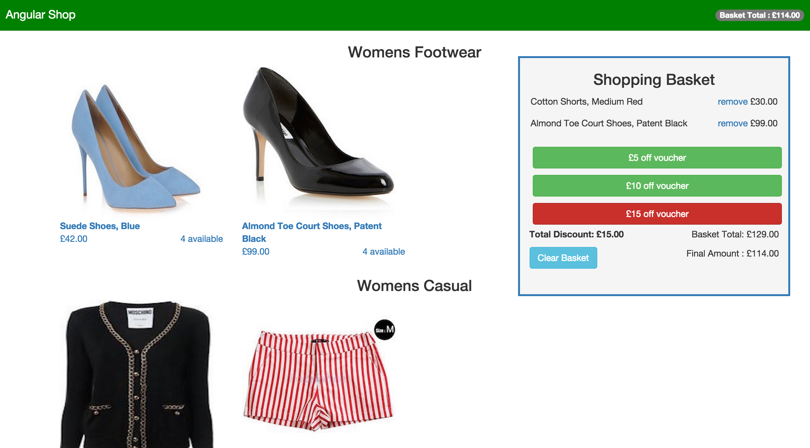
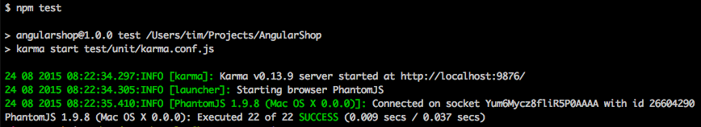
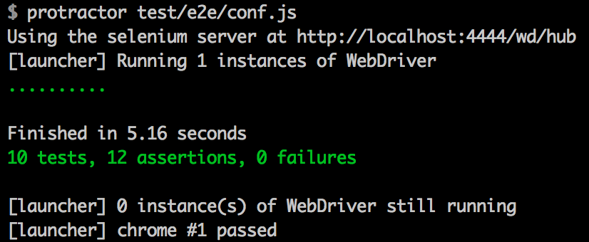

[](https://travis-ci.org/timrobertson0122/AngularShop)
[](https://codeclimate.com/github/timrobertson0122/AngularShop)

# AngularShop



Brief
-----

Develop a responsive website for a clothing retailer, satisfying the user stories below.

Technologies
------------

* Developed in AngularJS
* Node Express server
* Unit tested with Karma
* Feature tested with Protractor
* Styled with Bootstrap

Prerequisites
-------------

You will need the following installed locally:  

* Node.js
* NPM
* Bower
* Express

Site Setup
----------

* Execute the following in the command line:
* ```Git clone https://github.com/timrobertson0122/AngularShop.git```
* cd AngularShop
* ```bower install``` and ```npm install```
* ```npm start```

Navigate to ```localhost:4567``` in your browser.  

Testing Setup
-------------

For unit tests, run ```npm test``` in the command line (from within the projects' root directory):

  

For feature tests, run the following in the command line (from within the projects' root directory):
* ```npm start ```
* ```webdriver-manager start```
* ```protractor test/e2e/conf.js```



User Stories
------------

```
As a user, I can view the products and their category, price and availability information.

As a user I can add a product to my shopping cart

As a user I can remove a product from my shopping cart

As a user I can view the total price for the products in my shopping cart

As a user I can apply a voucher to my shopping cart

As a user I can view the total price for the products in my shopping cart with discounts applied

As a user I am alerted when I apply an invalid voucher to my shopping cart

As a user I am unable to add 'out of stock' products to my shopping cart

Vouchers
--------

£5.00 off your order

£10 off when you spend over £50

£15.00 off when you have bought at least one footwear item and spent over £75.00
```

Future Features
---------------

* Update item quantity when multiple items are added to the basket, rather than a new entry for each duplicate item.
* Better styling, e.g. hover over image 'Add to Basket' text
* Consider ng-show logic to only display available vouchers based on current products in shopping basket
* Individual product info pages
* Attach a database for product information, probably MongoDB
* Establish persistence across page refresh, add authenticated users
* Checkout functionality with payment processing, possibly Stripe
