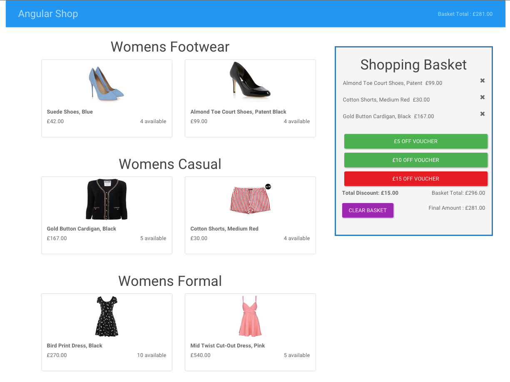

[](https://travis-ci.org/timrobertson0122/AngularShop)
[](https://codeclimate.com/github/timrobertson0122/AngularShop)

# AngularShop



Brief & Approach
----------------

The task I was set was to develop a responsive website for a clothing retailer, satisfying the user stories listed below.

Knowing it was expected to be responsive and given the time frame it was an easy decision to implement Bootstrap to speed this process up. I considered building in Rails but felt that, given the limited scope of the app, I could satisfy the user stories in a lighter, front-end framework - as such I felt an SPA in Angular would serve the purpose well, and give me a chance to improve my knowledge of Angular. If I were looking to scale this then Rails would be a wiser choice. 

Naturally, as this project was to be fully test-driven, and Protractor was written by the Angular team for e2e testing, and is written in Jasmine, I opted to use this for my feature tests, with Karma executing my unit tests. I knew these should play nice with Travis-CI, and I opted for CodeClimate to review my test coverage.

I initially toyed with storing my product data in an external JSON file and using Angular's $http service to provide the data to my app however, given the size of the data, realised it would be quicker to store it as a variable within the factory. Likewise I knew that the controller should not be handling business logic, so moved this out to the factory also, thus adhering to Angular's MVC principles, and simplifying my testing.

I opted to use Express to serve my app, as whilst I had never used it previously I knew it to be a lightweight and fast framework, which would suit my purposes fine for this project. Finally, I implemented the angular-flash module to provide error messages and improve the customer's experience.

Technologies
------------

* Developed in AngularJS
* Node Express server
* Tested in Jasmine, Karma for unit tests, Protractor for e2e testing
* Styled with Bootstrap
* angular-flash module for error message handling

Prerequisites
-------------

You will need the following installed locally:  

* Node.js
* NPM
* Bower
* Express
* Protractor with webdriver-manager

Site Setup
----------

* Execute the following in the command line:
* ```Git clone https://github.com/timrobertson0122/AngularShop.git```
* ```cd AngularShop```
* ```bower install``` and ```npm install```
* ```npm start```

Navigate to ```localhost:4567``` in your browser.  

Testing Setup
-------------

For unit tests, run ```npm test``` in the command line (from within the project's root directory):

  

For feature tests, run the following in the command line (from within the project's root directory):
* ```npm start ``` (unless already running)
* ```webdriver-manager start```
* ```protractor test/e2e/conf.js```


User Stories
------------

```
As a user, I can view the products and their category, price and availability information.

As a user I can add a product to my shopping cart

As a user I can remove a product from my shopping cart

As a user I can view the total price for the products in my shopping cart

As a user I can apply a voucher to my shopping cart

As a user I can view the total price for the products in my shopping cart with discounts applied

As a user I am alerted when I apply an invalid voucher to my shopping cart

As a user I am unable to add 'out of stock' products to my shopping cart

Vouchers
--------

£5.00 off your order

£10 off when you spend over £50

£15.00 off when you have bought at least one footwear item and spent over £75.00
```

Future Features
---------------

* Better styling, ensuring visually appealing and fully responsive. Improve UX e.g. hover over image 'Add to Basket' text, make it clearer to see that an item is out of stock.
* Update item quantity when multiple items are added to the basket, rather than a new entry for each duplicate item.
* Consider implementing ng-show directive to only display available vouchers based on current products in shopping basket (would also clarify with product owner as to whether a maximum of one voucher can be applied to any order)
* Individual product info pages
* Attach a database for product information, probably MongoDB
* Establish persistence across page refresh, add authenticated users
* Search functionality using filter directive
* Checkout functionality with payment processing, possibly Stripe
